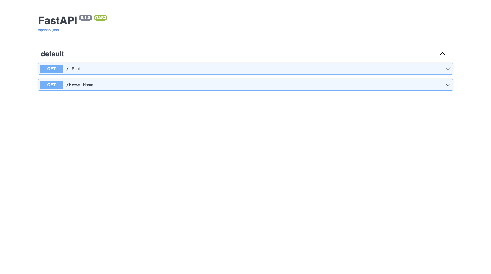

# USING FAST API

A simple app im using to learn the basics of fast API.

# Current Look



# Instructions

Clone the repository and then run:

```
$ pip3 install -r requirements.txt

$ uvicorn main:app --reload
```

## API Routes

```
http://localhost:8000/

https://localhost:8000/home
```

Open your browser and then go to `http://localhost:8000/docs#/` to see the docs for the api
